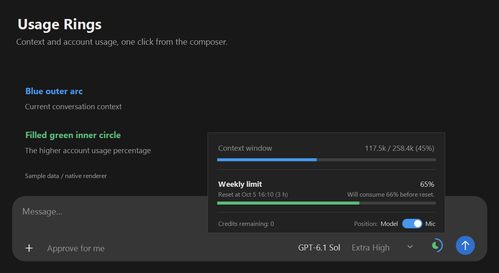
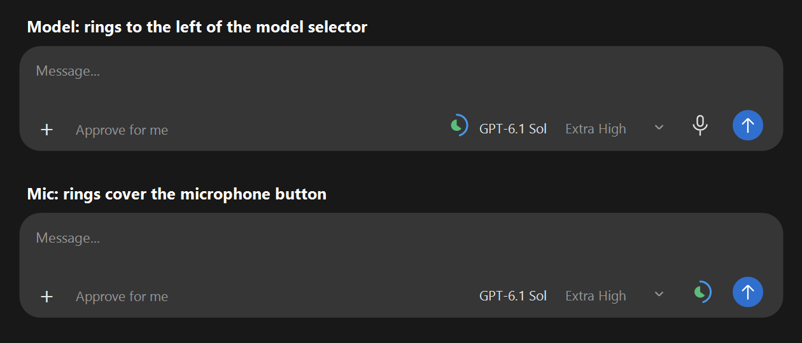
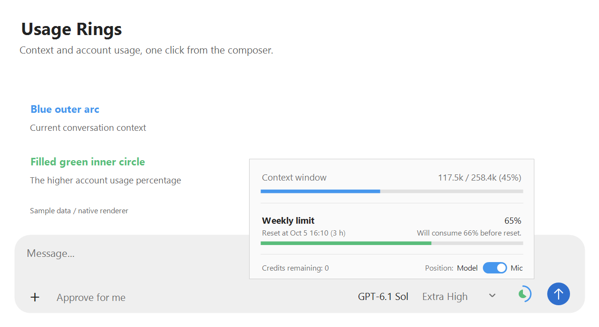
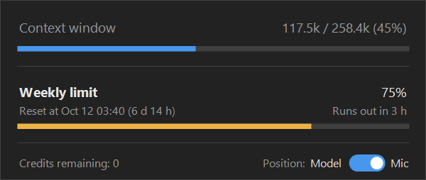
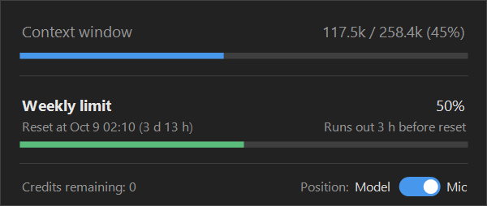
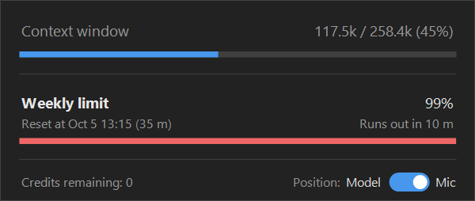
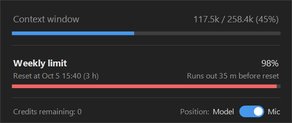
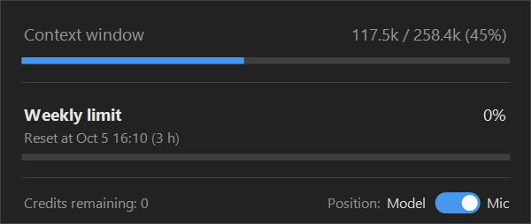
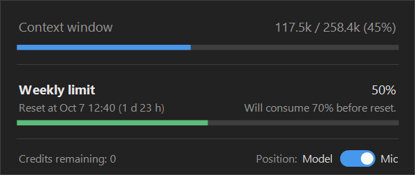

# Codex Usage Widget

用于 Windows Codex 的原生用量组件，显示当前对话的 context 和账号额度。

## Installation

在 Windows x64 上安装并登录 Codex，将完整项目放在固定目录，然后双击 `Setup.cmd`。安装程序会准备运行环境、安装依赖、执行测试、构建组件并启用自动启动。

也可以在 Codex 中打开项目目录，直接粘贴下面的 Markdown 指令：

```markdown
请安装当前项目中的 Codex Usage Widget。

1. 确认当前目录包含完整项目，以及 Setup.ps1、package.json、native、scripts、public 和 tests。检查 Windows x64、Codex 登录状态及所需运行环境；保留现有组件的位置设置。
2. 在项目目录中运行 powershell.exe -NoProfile -NonInteractive -ExecutionPolicy Bypass -File .\Setup.ps1。允许安装程序下载官方运行环境和依赖、执行测试、构建原生组件并启用自动启动。不要跳过校验或测试。
3. 读取 Setup_Report_Private.json，确认 success 为 true；如果安装失败，保留错误日志并解决具体问题。
4. 核实原生组件和自动启动器正在运行，再检查当前 Codex 对话中的圆环是否实际显示。无法直接确认界面时，应说明已验证的状态，不要仅凭进程存在就声称圆环已经可见。
```

安装需要网络连接。复制项目时可以省略 `node_modules`、`dist`、`native/build`、`_Claude_tmp` 和生成的 `*_Private.json`；请保留源码及测试目录。



*预览使用模拟数据。圆环和详情窗口由当前原生组件绘制，周围的输入区域是示意图。*

## Read the rings

| Element | Meaning |
|---|---|
| Outer arc | Context used by the selected conversation, divided by its model's context capacity |
| Filled inner circle | The higher used percentage of the account's short-term and weekly limits |
| Unfilled area | Transparent; zero usage draws no colored area |
| Missing data | Details show unavailable or an em dash, never a false zero |

The inner circle fills counterclockwise from the top. A full circle means 100% used.

所有百分比文字只显示向下取整后的整数，例如将 `99.9%` 显示为 `99%`。圆环填充、颜色阈值和耗尽预测仍使用原始数值计算；缺少数据的时候继续显示未知。

Click the rings to open or close details. Click outside the card or press Escape to dismiss it. Accounts without a short-term limit do not get an empty 5-hour row.

重置时间使用本地时区，例如 **`Reset at Oct 11 20:53 (6 d 20 h)`**。括号内的倒计时不足一天的时候只显示小时，例如 `3 h`；不足一小时的时候显示分钟，例如 `35 m`；不足一分钟的时候显示 `<1 m`。

**Credits are usage units, not a dollar balance.** The widget displays the interface's credit count without a dollar sign or an assumed conversion. Purchase prices depend on the plan or agreement. [Official credits explanation](https://learn.chatgpt.com/docs/pricing#what-are-tokens-and-credits)

## Choose a position



The **Position: Model / Mic** switch shares the bottom row with **Credits remaining**.

| Switch position | Widget location |
|---|---|
| Left / Model | Immediately left of the model selector |
| Right / Mic | Over the microphone, to the right of the model selector |

Both states use the same blue track and readable labels. The white knob indicates the selected side.

Changing the switch moves the rings immediately and saves the choice to `Usage_Widget_Settings_Private.json`. The open detail card stays in place. Clicking the rings again opens the card at the new position; dismissing and reopening it does the same.

The widget follows the desktop window and selected conversation. Background sampling spans the composer toolbar and excludes pixels covered by input-method candidates or other windows. If the model selector cannot be located, Model placement temporarily falls back to the microphone.

## Light appearance and thresholds



| Meter | Normal | Yellow | Red |
|---|---|---|---|
| Context, model capacity below 280,000 | Blue below 180,000 tokens | 180,000 to below 220,000 tokens | 220,000 tokens or more |
| Context, model capacity above 600,000 | Blue below 300,000 tokens | 300,000–400,000 tokens, inclusive | Above 400,000 tokens |
| Account usage | Green below 70% | 70%–85%, inclusive | Above 85% |

Context arc length uses the reported capacity; its color uses the absolute token count and the capacity tier. Capacities from 280,000 through 600,000, or an unavailable capacity, retain the 300,000/400,000 thresholds.

## Weekly usage forecast

周额度百分比下方的右侧预测文字与重置时间使用相同字号。程序根据本周已经使用的额度和已经经过的时间计算平均使用速度，并假设之后保持这个速度。本周期的开始时间由重置时间减去报告的周期长度计算；实际的未来使用速度可能变化。

如果预计额度会在重置前耗尽，程序会比较两个时长：从现在到预计耗尽的时间，以及从预计耗尽到重置的时间。只显示较小的时长；两者相等的时候，显示从现在到耗尽的时间。比较使用精确秒数，不受文字中天数、小时数和分钟数的取整影响。

| 界面文案 | 显示条件 |
|---|---|
| `Runs out in 3 h` | 从现在到耗尽的时间较短，或者两个时长相等 |
| `Runs out 3 h before reset` | 耗尽后距离重置的时间较短 |
| `Runs out in 35 m` / `Runs out 35 m before reset` | 选中的时长不足一小时，改为显示分钟 |
| `Will consume 70% before reset.` | 预计额度能够持续到重置，数值表示本周期截至重置的总使用比例 |
| 不显示预测文字 | 没有任何使用，或者使用比例、周期长度、重置时间及已经经过的时间不足以支持估算 |

耗尽预测和重置时间括号里的倒计时使用相同的时长格式。天数为零的时候省略天数；不足一小时的时候只显示分钟；不足一分钟的时候显示 `<1 m`。显示的天数、小时数和分钟数向下取整。

| 剩余时长示例 | 界面显示 |
|---|---|
| 1 天 10 小时 | `1 d 10 h` |
| 3 小时 30 分钟 | `3 h` |
| 35 分钟 30 秒 | `35 m` |
| 20 秒 | `<1 m` |

以下截图使用模拟数据，并由当前版本的原生组件直接绘制。截图中的重置时间根据生成截图时的本地时间计算。

| 距离耗尽较短，显示从现在到耗尽的时间 | 距离重置较短，显示提前耗尽的时间 |
|---|---|
|  |  |

| 重置倒计时与耗尽预测都显示分钟 | 提前耗尽的时间显示分钟 |
|---|---|
|  |  |

| 没有任何使用，不显示预测 | 额度能够持续到重置，显示预计总使用比例 |
|---|---|
|  |  |

## Silent startup

After setup, a native supervisor starts at Windows sign-in and checks the supported desktop app every two seconds. It starts the widget with the app, reuses it across new conversations, and restores it if it exits. Failed launches retry after at least 15 seconds.

Normal startup opens no console or webpage and sends no conversation messages. Each program allows one instance in the current Windows session. Autostart uses a current-user Startup shortcut; preferences use project JSON files.

Keep the project folder in place. If you move it, run `Setup.cmd` from the new location.

To disable autostart and recovery, run from the project folder:

~~~powershell
npm run autostart:remove
~~~

The current widget stays open. Quit it from the rings' right-click menu or the system tray menu. With autostart enabled, quitting only the widget makes the supervisor restore it.

If setup installed portable Node.js and `npm` is unavailable in your terminal:

~~~powershell
$deployment = Get-Content .\native\Local_Deployment_Private.json -Raw | ConvertFrom-Json
& $deployment.nodeExecutable .\scripts\install-autostart.mjs --remove
~~~

## Data and compatibility

Context refreshes every five seconds from the bound local conversation's numeric usage events: the latest request's `last_token_usage.total_tokens` and `model_context_window`, not cumulative billed tokens. The first read scans the bound log for numeric events; subsequent reads consume only new complete lines. Large tool outputs do not erase previously reported context. Compaction clears old context values until a new event arrives.

Account limits use the read-only `account/rateLimits/read` interface, cached for up to one minute. A valid recorded quota may be used if live data is unavailable; the card's tooltip identifies recorded data. Expired records stop filling the inner circle.

原生组件读取当前页面的辅助功能标题，并在只读的本地对话索引中查找唯一对应的明确对话 ID。组件启动和窗口恢复后会主动核实页面，不需要先切换对话。页面改变后会先清除旧的 context，并丢弃属于旧页面的延迟结果。空白的新建页面、重名对话、多窗口或无法核实的页面均显示未知；新对话收到数值用量事件后才显示实际用量。组件仍会通过经过核实的本地会话元数据解析子代理的父对话关系，不会按照文件修改时间猜测当前对话，也不会读取对话正文或登录凭据。

This is an independent native overlay, not an official composer extension. It does not patch the desktop app. Recognition and IPC may need adjustments after desktop updates. Supported installations are the Windows `OpenAI.Codex` desktop distribution and its recognized legacy Codex installation, rather than every application named ChatGPT.

## Troubleshooting

| Symptom | Check |
|---|---|
| Desktop app not found | Install the supported Windows app under the same Windows user; rerun setup |
| Rings are hidden | Bring the app to the foreground with a conversation composer visible |
| Context unavailable | Select a local conversation in one supported window. After compaction or before the first reported usage event, wait for the next usage update; the card tooltip explains this state |
| Account usage unavailable | Check the signed-in account; allow a minute for refresh |
| Position is not saved | Make sure the project folder is writable |
| Startup fails after moving the folder | Run `Setup.cmd` in the new location |

Diagnostic files are excluded from version control: `Setup_Report_Private.json`, `Autostart_Installation_Private.json`, `_Claude_tmp/Native_Widget_State_Private.json`, and `_Claude_tmp/Autostart_State_Private.json`.

## Development and optional plugin

With Node.js 24 or newer already available:

~~~powershell
npm ci
npm run native
npm test
~~~

`npm run native:build` rebuilds the GUI. Its `--render-test <output-directory>` option checks ring rendering and generates dark/light detail images.

Setup installs the native widget and autostart directly. The optional plugin adds a manual skill and MCP entry:

~~~powershell
node build.mjs
codex plugin marketplace add . --json
codex plugin add codex-usage-rings@usage-rings-local --json
~~~

`plugin.json` is the current manifest; `.codex-plugin/plugin.json` supports the older layout. `USAGE_RINGS_CODEX_COMMAND` overrides the CLI path; existing `CODEX_HOME` settings are respected. Legacy browser/MCP Apps views remain an explicit manual choice.

The setup fallback CLI is pinned to 0.160.0 for protocol compatibility. Tests cover data binding, stale and missing data, thresholds, IPC, autostart, portable deployment, runtime verification, and native detail behavior.

## References

- [OpenAI plugin installation](https://developers.openai.com/plugins/build/plugins)
- [OpenAI UI extensions](https://developers.openai.com/plugins/build/extensions)
- [Codex app-server](https://developers.openai.com/codex/app-server)
- [CodexUsage native overlay reference](https://github.com/jayhilwig/codexusage)
- [CodexTokenOverlay conversation identification reference](https://github.com/soleillevant0125/codex-token-overlay)
